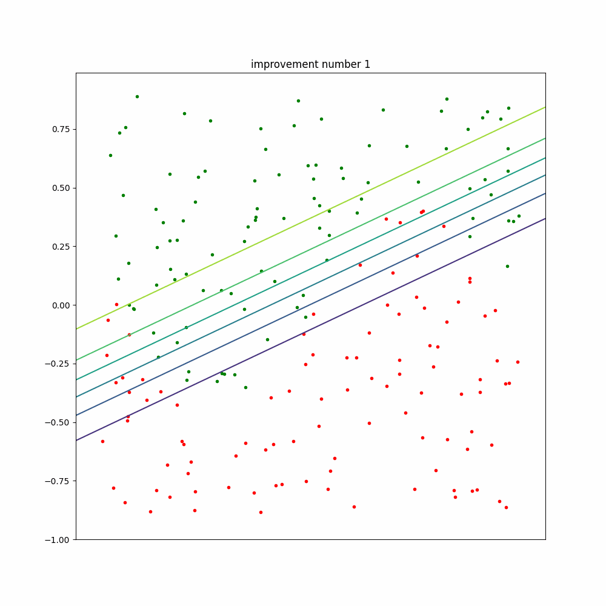
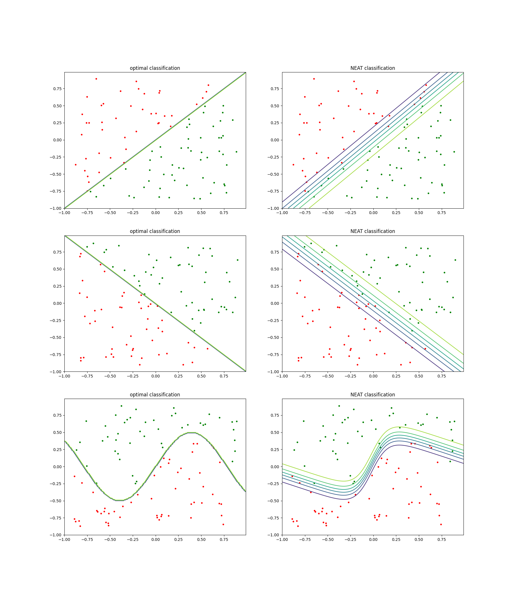

# NEAT experiments
this repo holds some experiments I did with [neat-python](https://pypi.org/project/neat-python/)

most of what you see done with NEAT, is from the [examples-section in the repo](https://github.com/CodeReclaimers/neat-python/tree/master/examples)


## animation

*im sorry collerblind ppl, point set one and point set two are in red and green*

## requirements:
python3

pip3 

neat-python

## run
```bash
python3 fit_tests_neat.py
```

## results:

